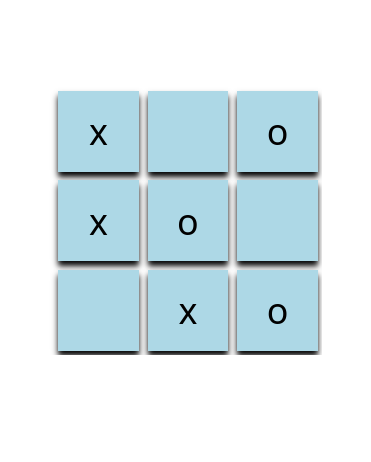

# Tic-Tac-Toe — UI Layout Practice

> **Note:** This project is not functional as a game. It was built purely as a layout and styling exercise during the early stages of my frontend learning journey.

---

## OVERVIEW

This is one of my earliest frontend projects — and the repository where I made my **first ever Git commit**.

It is a static Tic-Tac-Toe board built with HTML and CSS. There is no JavaScript, no game logic, no win detection, and no interactivity. The X and O values are hardcoded directly in the HTML. The goal was never to build a working game; it was to practice laying out elements on a page using CSS — and to get comfortable pushing code to GitHub for the first time.

I'm keeping this repository public because it is an honest part of my developer history. I believe in documenting where I started, not just where I am.

---

## Introduction

This project was built as part of the **Ethio Coders / Udacity** frontend learning program — a structured challenge series designed to introduce students to core web development concepts through hands-on practice.

The challenge wasn't about building a real game. It was about applying layout skills in a concrete context: taking a familiar grid and trying to construct it from scratch with HTML and CSS alone.

---

## Technologies Used

- HTML5
- CSS3

No frameworks. No libraries. No JavaScript.

---

## What the Code Actually Does

Looking at the source honestly:

- Nine `<li>` elements inside a `<ul>` represent the nine cells of the board
- **`float: left`** is used to position the cells into a grid — the older layout method I was learning at the time, before properly understanding Flexbox
- **`display: flex`** is used *inside* each `<li>` to center the X or O text — this was my first real encounter with Flexbox, even if I didn't fully understand it yet
- `overflow: hidden` is applied globally on `*` — likely added to fix a float collapse side effect, though I didn't fully understand what it was doing to the rest of the page at the time
- The X and O values are **hardcoded in the HTML** — there is no dynamic behavior of any kind
- A hover effect changes the cell background to black and the text to light blue

That is the full scope of the project.

---

## What I Was Learning at the Time

When I built this, my focus was on:

- Understanding the **CSS box model** — margin, padding, border, and how they interact
- Using **`float: left`** to position block elements side by side
- Getting a first exposure to **`display: flex`** for aligning content inside elements
- Writing clean, readable HTML structure
- Getting comfortable with the **Git workflow** — staging, committing, and pushing to GitHub for the first time

These may seem like small things now, but each one required real effort to understand at the time.

---

## Current Project Status

**Incomplete — intentionally preserved.**

The project renders a static Tic-Tac-Toe grid with hardcoded values. It has no game logic, no JavaScript, and no interactivity. It looks like a game board, but it does not behave like one.

I have no plans to extend this specific repository. It exists as a snapshot of where I started.

---

## Screenshot

*A static HTML/CSS layout with hardcoded X and O values — built using `float: left` for grid positioning and `display: flex` for cell alignment.*

---

## Lessons Learned

Looking back at this code, a few things stand out:

- **`float: left` is not the right tool for grid layouts.** It works, but it comes with side effects — like collapsing parent containers — that I was patching without understanding. CSS Grid or Flexbox on the parent would have been cleaner.
- **`overflow: hidden` on `*` is a global side effect.** I added it to fix float behavior, but it silently hides all overflow content across the entire page. At the time I had no idea it did that.
- **Hardcoding values is fine for a layout exercise.** But recognizing *why* it's limited — that you'd need JavaScript to make it dynamic — was an important conceptual step that came after this.
- **The first commit matters more than the code quality.** Getting something into a repository and pushing it was a real milestone. The workflow felt foreign and intimidating; now it's second nature.

---

## Ideas for Future Improvement

*(Not planned for this repo — listed here as a learning note for future projects)*

If this were to be built out properly:

- Replace `float: left` with CSS Grid on the `<ul>` for a cleaner layout
- Remove the global `overflow: hidden` and handle float collapse properly
- Add JavaScript to manage player turns and board state
- Implement win detection logic
- Add a reset button
- Make the layout responsive for smaller screens

---

## Reflection

This repository is where my frontend journey began. When I created it, I had very little confidence in my ability to write code, let alone write it well.

Two years later, I am a third-year Software Engineering student actively building real projects, studying data structures and algorithms, learning React, and taking on freelance work. Looking back at this code now, I can see exactly what I didn't understand — and that gap between then and now is what growth actually looks like.

I keep this repository because every developer has a starting point. This was mine.

---

## Author

**Yeabtsega Tesfaye**
Software Engineering Student — Woldia University, Ethiopia
[GitHub Profile](https://github.com/Yeabtsega-Tesfaye)
